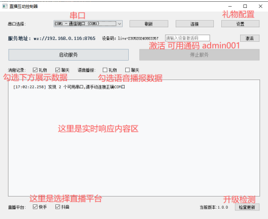
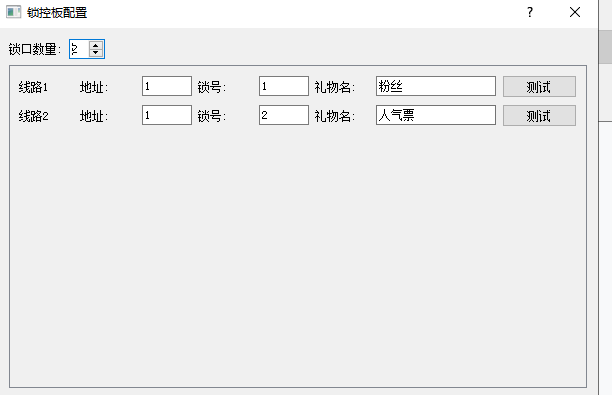
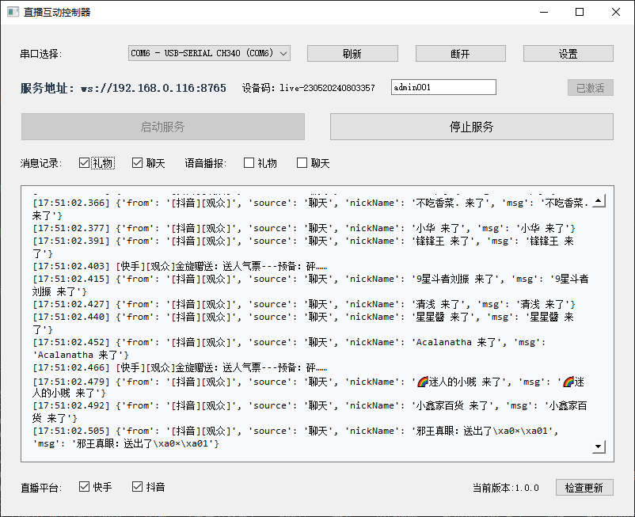
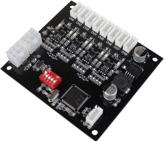

# 📡 数据监听工具 (Data Listener Tool)

一个基于本地代理/本机浏览器的开源数据监听工具，**不依赖任何远程服务器**，专注于本地数据采集与展示。  

⚠️ **重要提醒**  
在使用本程序之前，请务必仔细阅读并理解 [LICENSE](./LICENSE) 文件中的条款与免责声明。  
若您不同意其中任何内容，请立即停止使用本程序。  

---

## ✨ 功能特点
- 📍 **本地运行**：数据仅通过本机代理或浏览器获取，不涉及远程服务器  
- 🔒 **隐私友好**：开发者不收集、不存储任何用户数据  
- ⚙️ **开源可扩展**：支持二次开发、自由修改与分发  
- 🚀 **轻量高效**：部署简单，使用方便  

---

## 🛠️ 安装油猴脚本（Tampermonkey）

### 1. 安装油猴扩展
| 浏览器 | 安装方式 |
|--------|----------|
| Chrome | ⚠️ Chrome 商店访问受限，需手动下载 [Tampermonkey 官网](https://www.tampermonkey.net/index.php?browser=chrome) 提供的 `.crx` 文件并拖拽到 `chrome://extensions/` 页面安装 |
| Edge / Firefox / Safari | 直接访问 [Tampermonkey 官网](https://www.tampermonkey.net/index.php?browser=chrome) 点击对应浏览器图标即可一键安装 |

### 2. 导入脚本
1. 安装完成后，点击浏览器右上角的 **油猴图标** → **管理面板**  
2. 在管理面板中点击 **“+” 新建脚本**（或 **“新建脚本”** 按钮）  
3. 将脚本文件夹中的 **全部内容** 复制到打开的编辑器中  
4. 按 `Ctrl/Cmd + S` 保存，脚本即可生效  

> 脚本激活后，会在匹配的网站自动运行，开始本地数据监听。

---

## 📄 许可证
本项目基于 [LICENSE](./LICENSE) 开源发布，使用即表示您已阅读并同意其全部条款。

## 实例展示

注意 实际 需要搭配 硬件使用 

## 所需硬件 
- 1、电源适配器 
- 2、usb转串口线
- 3、锁控板
> 
- 4、电磁铁

## 最终项目效果展示 

## 注意
- js 目录中脚本 内部的 地址 需要自己 修改下 避免某些问题